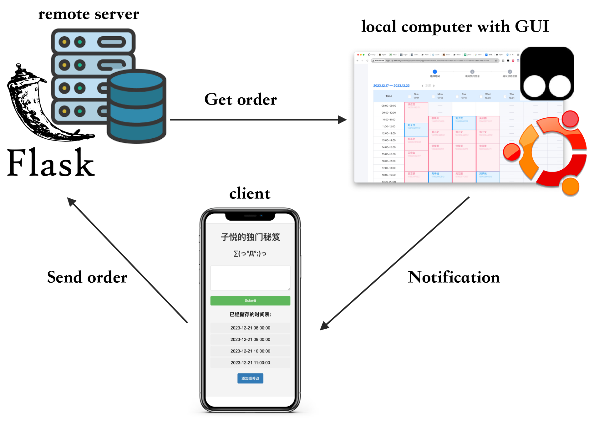

## 佰能预约平台自助抢单 SnatchBynonco

## Introduction

本项目是为佰能预约平台设计的自助仪器预约系统。它旨在自动化为女朋友抢订单的过程。

This project is a self-service equipment grabbing system designed for the Bynonco Platform. It aims to automate the process of delivering appointments for my girlfriend



图中所示的框架展示了设计用于佰能预约平台上的自助订单抢单的多组件系统。以下是组件和信息流的说明：

1. Flask 远程服务器：运行在远程服务器上的系统后端部分，使用 Flask web 框架维护一个可供外部访问的预约订单界面。用户可以与服务器交互，更新抢单时间，并发送当天需要抢占的时段信息到本地计算机。

2. 本地计算机带有 GUI：浏览器保持在抢单界面，油猴脚本会定时从远程服务器获取抢单时段，刷新页面并执行表单填写逻辑。

3. 客户端：移动客户端使用Web浏览器，允许用户与远程服务器系统进行交互。通过这个设备，用户可以查看和更新未来N天可用的时间段，并提交订单。

----

The diagram shown illustrates a multi-component system designed for self-service order grabbing on the Bynonco appointment platform. The following are descriptions of the components and information flows:

1. Flask Remote Server: The backend portion of the system running on a remote server, using the Flask web framework to maintain an appointment order interface accessible externally. Users can interact with the server, update their order-grabbing times, and send information about the time slots they want to occupy for the day to the local computer.
2. Local Computer with GUI: The browser remains on the order-grabbing interface, and a Greasemonkey script periodically retrieves order-grabbing time slots from the remote server, refreshes the page, and executes form-filling logic.
3. Client: A mobile client using a web browser, allowing users to interact with the remote server system. Through this device, users can view and update available time slots for the next N days and submit orders.

## Installation

~~### 在远程服务器端:~~

**目前的版本已经废弃这个功能，请直接在本地安装执行**

```shell
pip3 install flask flask-cors
python3 install server_side.py
```

### 在GUI 本地计算机端：

下载油猴脚本，新建脚本，将`main.js` 内容添加进去

进入预约界面，例如 [例子](http://dypt.ujs.edu.cn/console/appointment/AppointmentBoxContainer?id=e39418c7-53ed-44fa-9eab-c8852952d219) ，然后启动油猴脚本插件等待

### 调整时间

在 main.js line 34-38 
```javascript
backupDate.setDate(backupDate.getDate() + 3); // Add 3 days

backupDate.setHours(21, 0, 0, 0); // Set the start time to 13:00:00

for (var i = 0; i < 4; i++) { // set time interval to 4 block
```

----

~~### On the remote server side:~~
**Current version already abandon this function please install it in the local machine**
```shell
pip3 install flask flask-cors

python3 install server_side.py
```

### On the GUI local computer side:

Download the Tampermonkey script, create a new script, and add the content of main.js to it.

Go to the appointment interface, and then activate the Tampermonkey script plugin.

## Further development

实现多设备多用户预约，使其平台化。

Realize multi-device multi-user reservation and make it platformized.

